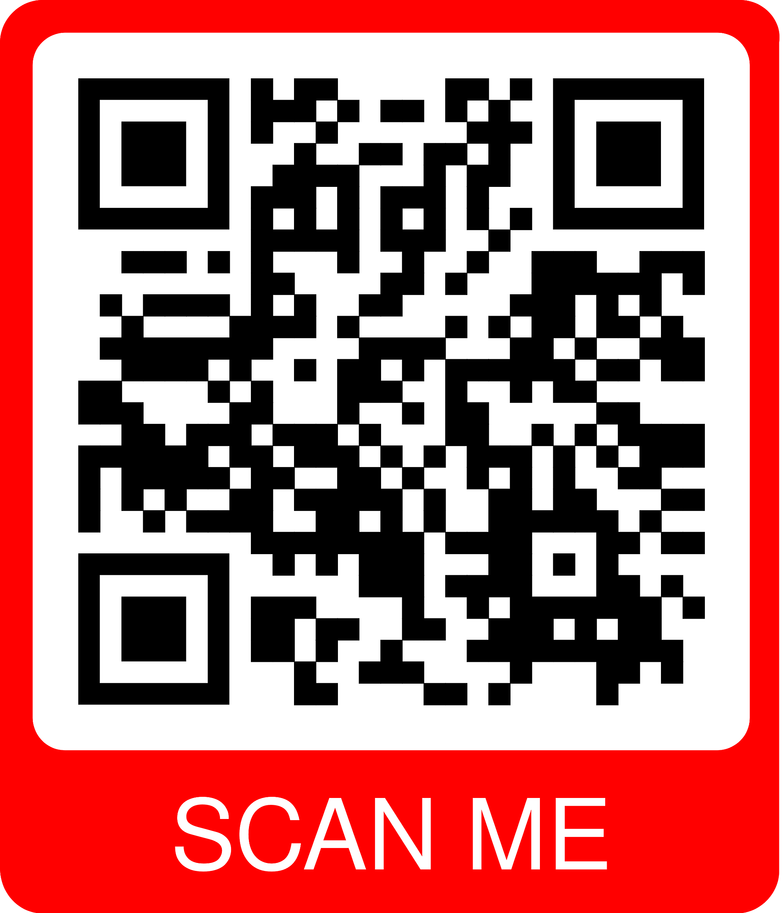

# 🚀 SHATZ - Experiencia Visual

Bienvenido a **SHATZ**, donde la innovación en diseño web cobra vida. Nos especializamos en soluciones digitales creativas que combinan diseño y tecnología para generar experiencias únicas y efectivas.
Puedes visitar nuestra página web con este enlace: [SHATZ Web](https://mbescalante.github.io/web-shatz/)  

📱 También puedes escanear este QR para dirigirte desde tu teléfono directamente a la página:  

---

## 🎯 Sobre Nosotros

En **SHATZ**, nos enfocamos en ofrecer soluciones de diseño y desarrollo web que potencien la presencia digital de nuestros clientes. Nuestro objetivo es brindar experiencias visuales atractivas, funcionales y optimizadas.

### 🔥 ¿Qué nos hace diferentes?
✅ **Diseño innovador** con animaciones CSS y jQuery.  
✅ **Plantillas versátiles** adaptables a diferentes negocios.  
✅ **Interfaces atractivas** y optimizadas para la mejor experiencia de usuario.  
✅ **Soluciones digitales** combinando creatividad y tecnología.  

---

## 💼 Nuestros Servicios

### 🎨 Diseño UX/UI
- Creación de interfaces intuitivas y atractivas.  
- Experiencia de usuario optimizada para navegación fluida.  
- Accesibilidad y usabilidad mejoradas.  

### 🌍 Desarrollo Web
- Sitios web responsivos y adaptables a diferentes dispositivos.  
- Implementación de **Bootstrap** para un diseño moderno y dinámico.  
- Integración con tecnologías avanzadas para mejor funcionalidad.  

### 📈 Marketing Digital & SEO
- Estrategias para mejorar la presencia en línea de tu negocio.  
- Optimización de sitios web para motores de búsqueda (**SEO**).  
- Análisis y mejoras de rendimiento digital.  

### 📱 Desarrollo de Apps Android
- Aplicaciones personalizadas con una experiencia de usuario fluida.  
- Interfaz moderna con **Material Design**.  
- Integración con bases de datos y APIs externas.  

### 🔧 Código Limpio y Escalable
- Implementación de **buenas prácticas** de desarrollo.  
- Código estructurado y fácil de mantener.  
- Optimización para velocidad y rendimiento.  

---

## 🛠️ Tecnologías Utilizadas

| Tecnología      | Descripción |
|---------------|------------|
| **HTML5**      | Estructura semántica y accesible. |
| **CSS3**       | Diseño moderno y responsive. |
| **Bootstrap**  | Interfaces dinámicas y adaptables. |
| **FontAwesome** | Íconos personalizables y atractivos. |
| **Wow.js**     | Animaciones interactivas para una experiencia envolvente. |
| **JavaScript & jQuery** | Funcionalidades avanzadas y efectos dinámicos. |

---

## 👥 Contribuciones
Si deseas contribuir a este proyecto, no dudes en hacer un **fork** y enviar un **pull request** con mejoras, correcciones o nuevas ideas. ¡Toda ayuda es bienvenida! 💡

---

## 📜 Licencia
Este proyecto está bajo la **licencia MIT**, lo que significa que puedes usarlo, modificarlo y distribuirlo libremente siempre que se mantenga la atribución correspondiente.

---

**Gracias por visitar SHATZ! 🚀**

